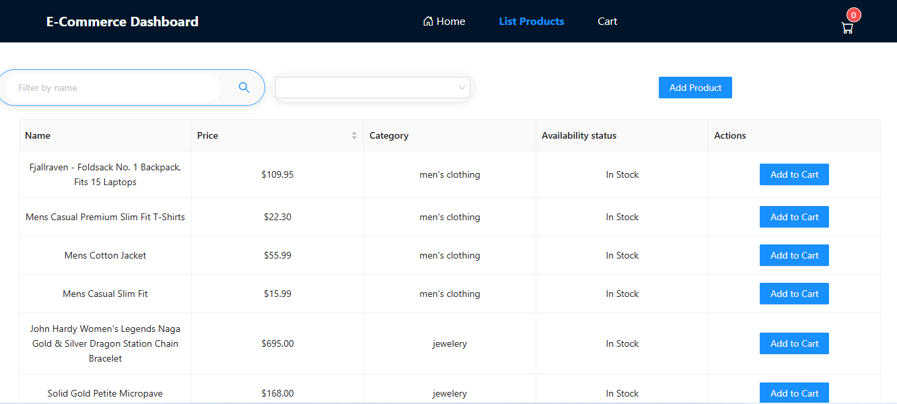
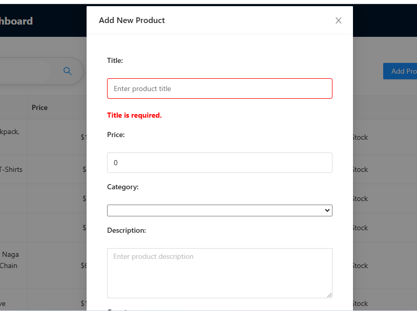
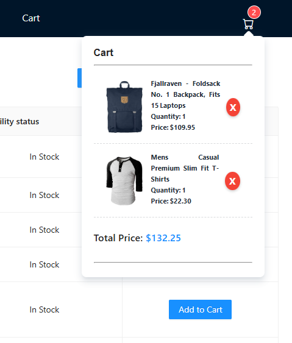
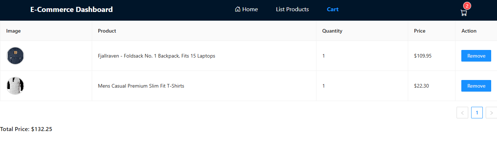
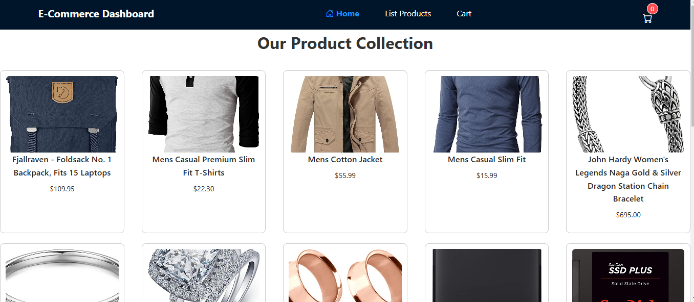

# Application NestJs and angular 16 ,Public Api( https://fakestoreapi.com)

## Features

- Set up the Angular project, install dependencies, and configure NG-ZORRO.
- Implement the product listing page with NG-ZORRO Table and sorting/searching.
- Add the navbar and dynamically update the cart status using NG-ZORRO Badge.
- Implement cart management and integrate cart updates into the navbar.
- Implement the "Add Product" feature using an NG-ZORRO Modal with a fully functional form.
- Product List in Page Home

#### Product List(**NG-ZORRO Table**)

#### Add Product (**NG-ZORRO Modal** )

#### Cart Navbar

#### Page Cart

#### Page Home (It's plus)

#### Video
[![Watch the video]](https://drive.google.com/file/d/1k47OE2iR_n4I0oPgdIwNo5fxNGhaODuW/view?usp=drive_link)

## Contributors

- [Chouaibi Mohamed Aymen](https://github.com/aymen-1996)